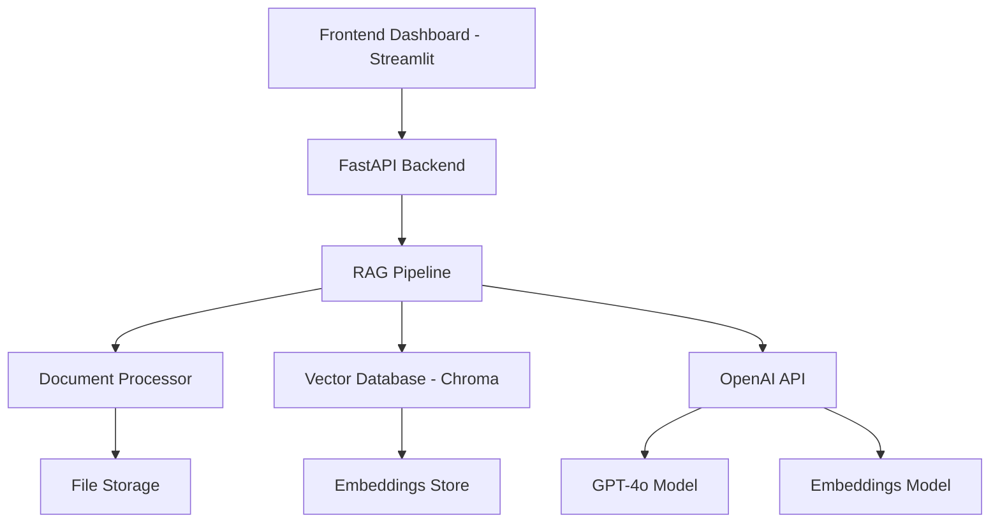

# Design Document

## Overview

The RAG Dashboard System is designed as a modern, scalable application that combines document processing, vector search, and AI-powered question answering in a user-friendly interface. The system follows a modular architecture with clear separation between the backend processing pipeline, vector database operations, and frontend presentation layer.

The system will be built using Python with FastAPI for the backend API, Streamlit for the frontend dashboard, OpenAI for embeddings and text generation, and Chroma as the vector database. This combination provides rapid development capabilities while maintaining professional quality suitable for client demonstrations.

## Architecture

### High-Level Architecture



### Component Architecture

The system is organized into the following main components:

1. **Frontend Layer (Streamlit)**: User interface for file upload, query input, and results display
2. **API Layer (FastAPI)**: RESTful endpoints for document processing and query handling
3. **RAG Pipeline**: Core business logic for document processing, embedding, and retrieval
4. **Vector Database (Chroma)**: Storage and retrieval of document embeddings
5. **External Services (OpenAI)**: Embedding generation and text completion

### Data Flow

1. User uploads documents through Streamlit interface
2. FastAPI receives files and triggers document processing
3. Documents are chunked and embedded using OpenAI embeddings
4. Embeddings are stored in Chroma vector database
5. User submits queries through the interface
6. System retrieves relevant chunks using vector similarity search
7. Retrieved context is sent to GPT-4o for answer generation
8. Generated answer is displayed in the dashboard

## Components and Interfaces

### 1. Document Processor (`document_processor.py`)

**Purpose**: Handle file upload, text extraction, and document chunking

**Key Classes**:
- `DocumentProcessor`: Main class for document processing
- `TextExtractor`: Extract text from PDF and TXT files
- `DocumentChunker`: Split documents into overlapping chunks

**Key Methods**:
```python
class DocumentProcessor:
    def extract_text(self, file_path: str, file_type: str) -> str
    def chunk_document(self, text: str, chunk_size: int = 800, overlap: int = 100) -> List[str]
    def process_document(self, file_path: str) -> List[DocumentChunk]
```

**Dependencies**: PyPDF2 for PDF processing, tiktoken for token counting

### 2. RAG Pipeline (`rag_pipeline.py`)

**Purpose**: Core RAG functionality including embedding, storage, and retrieval

**Key Classes**:
- `RAGPipeline`: Main orchestrator for RAG operations
- `EmbeddingManager`: Handle OpenAI embedding generation
- `VectorStore`: Interface with Chroma database
- `QueryProcessor`: Process user queries and generate responses

**Key Methods**:
```python
class RAGPipeline:
    def embed_documents(self, chunks: List[str]) -> List[List[float]]
    def store_embeddings(self, chunks: List[str], embeddings: List[List[float]]) -> None
    def retrieve_relevant_chunks(self, query: str, k: int = 5) -> List[RetrievedChunk]
    def generate_answer(self, query: str, context: List[str]) -> str
```

**Dependencies**: OpenAI API, Chroma, numpy for vector operations

### 3. FastAPI Backend (`app.py`)

**Purpose**: RESTful API endpoints for frontend communication

**Key Endpoints**:
- `POST /upload`: Handle document uploads
- `POST /query`: Process user queries
- `GET /documents`: List uploaded documents
- `GET /stats`: Get system statistics
- `POST /demo`: Trigger demo mode

**Key Models**:
```python
class UploadResponse(BaseModel):
    success: bool
    message: str
    document_id: str

class QueryRequest(BaseModel):
    question: str
    show_context: bool = False

class QueryResponse(BaseModel):
    answer: str
    context: Optional[List[str]]
    retrieval_time: float
    generation_time: float
```

### 4. Streamlit Frontend (`dashboard.py`)

**Purpose**: User interface for all system interactions

**Key Components**:
- File upload widget with progress tracking
- Query input with example suggestions
- Results display with copy functionality
- Sidebar with system statistics
- Demo mode activation button

**Key Functions**:
```python
def render_upload_section() -> None
def render_query_section() -> None
def render_results_section(response: QueryResponse) -> None
def render_sidebar_stats() -> None
def activate_demo_mode() -> None
```

### 5. Configuration Manager (`config.py`)

**Purpose**: Centralized configuration management

**Key Settings**:
- OpenAI API configuration
- Chroma database settings
- Chunking parameters
- UI customization options

## Data Models

### Document Chunk
```python
@dataclass
class DocumentChunk:
    id: str
    content: str
    source_document: str
    chunk_index: int
    token_count: int
    embedding: Optional[List[float]] = None
```

### Retrieved Chunk
```python
@dataclass
class RetrievedChunk:
    chunk: DocumentChunk
    similarity_score: float
    highlighted_content: str
```

### Document Metadata
```python
@dataclass
class DocumentMetadata:
    id: str
    filename: str
    file_type: str
    upload_time: datetime
    chunk_count: int
    processing_status: str
```

### System Statistics
```python
@dataclass
class SystemStats:
    total_documents: int
    total_chunks: int
    total_queries: int
    average_retrieval_time: float
    average_generation_time: float
```

## Error Handling

### Error Categories

1. **File Processing Errors**:
   - Unsupported file formats
   - Corrupted files
   - Large file handling

2. **API Errors**:
   - OpenAI API failures
   - Rate limiting
   - Authentication issues

3. **Database Errors**:
   - Chroma connection issues
   - Storage failures
   - Query errors

4. **User Input Errors**:
   - Empty queries
   - Invalid file uploads
   - Missing documents

### Error Handling Strategy

```python
class RAGException(Exception):
    def __init__(self, message: str, error_type: str, details: dict = None):
        self.message = message
        self.error_type = error_type
        self.details = details or {}

class ErrorHandler:
    def handle_processing_error(self, error: Exception) -> dict
    def handle_api_error(self, error: Exception) -> dict
    def handle_user_error(self, error: Exception) -> dict
```

### User-Friendly Error Messages

- File processing: "Unable to process document. Please ensure it's a valid PDF or TXT file."
- API failures: "Service temporarily unavailable. Please try again in a moment."
- Empty queries: "Please enter a question about your uploaded documents."
- No documents: "Please upload documents before asking questions."

## Testing Strategy

### Unit Testing

**Document Processing Tests**:
- Text extraction from various file formats
- Chunking algorithm validation
- Token counting accuracy

**RAG Pipeline Tests**:
- Embedding generation
- Vector similarity calculations
- Query processing logic

**API Endpoint Tests**:
- Request/response validation
- Error handling
- Authentication

### Integration Testing

**End-to-End Workflows**:
- Complete document upload and processing
- Query submission and response generation
- Demo mode functionality

**External Service Integration**:
- OpenAI API integration
- Chroma database operations
- File system operations

### Performance Testing

**Load Testing**:
- Multiple concurrent document uploads
- High-frequency query processing
- Large document handling

**Response Time Testing**:
- Embedding generation time
- Retrieval performance
- Answer generation speed

### Demo Testing

**Demo Mode Validation**:
- 15-second completion requirement
- Automatic workflow execution
- Error-free demonstration flow

## Deployment Architecture

### Local Development
```
├── app.py (FastAPI backend)
├── dashboard.py (Streamlit frontend)
├── rag_pipeline.py (Core logic)
├── document_processor.py (File processing)
├── config.py (Configuration)
├── requirements.txt (Dependencies)
└── data/ (Local file storage)
```

### Production Deployment Options

**Option 1: Streamlit Cloud + FastAPI on Render**
- Frontend: Streamlit Cloud hosting
- Backend: Render web service
- Database: Chroma with persistent storage

**Option 2: Docker Container**
- Single container with both services
- Nginx reverse proxy
- Volume mounts for data persistence

**Option 3: Cloud VM**
- Ubuntu server with Docker
- SSL certificate setup
- Automated backup configuration

### Environment Variables
```
OPENAI_API_KEY=your_openai_key
CHROMA_PERSIST_DIRECTORY=./chroma_db
MAX_FILE_SIZE=10MB
CHUNK_SIZE=800
CHUNK_OVERLAP=100
```

## Security Considerations

### API Security
- Input validation and sanitization
- File type verification
- Size limits on uploads
- Rate limiting on endpoints

### Data Security
- Secure API key management
- Temporary file cleanup
- User data isolation
- HTTPS enforcement

### Privacy
- No persistent storage of user queries
- Document deletion capabilities
- Clear data retention policies